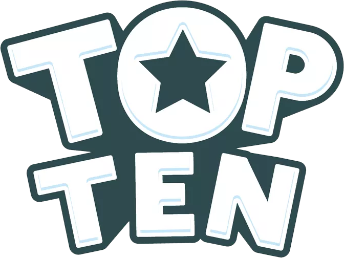

# Top Ten

 
 

A mobile app based on a board game with the same name and which serves as a virtual inventory replacement for the physical components of that game, including cards, chips, and the board. Additionally, it assists in calculating winning points.
 
 

##Disclaimer
This app is a tribute to the original game and is not affiliated with or endorsed by "Interlude" or "TOP TEN". All associated copyrights and trademarks belong to their respective owners. The physical version with full set of tasks can be found [on their website](https://www.cocktailgames.com/en/game/top-ten/).

### 🎨 Color Reference

| Color          | Hex                                                                |
| -------------- | ------------------------------------------------------------------ |
| Navy           |  `#0a192f` |
| Light Navy     |  `#112240` |
| Lightest Navy  |  `#233554` |
| Slate          |  `#8892b0` |

### Screenshots

